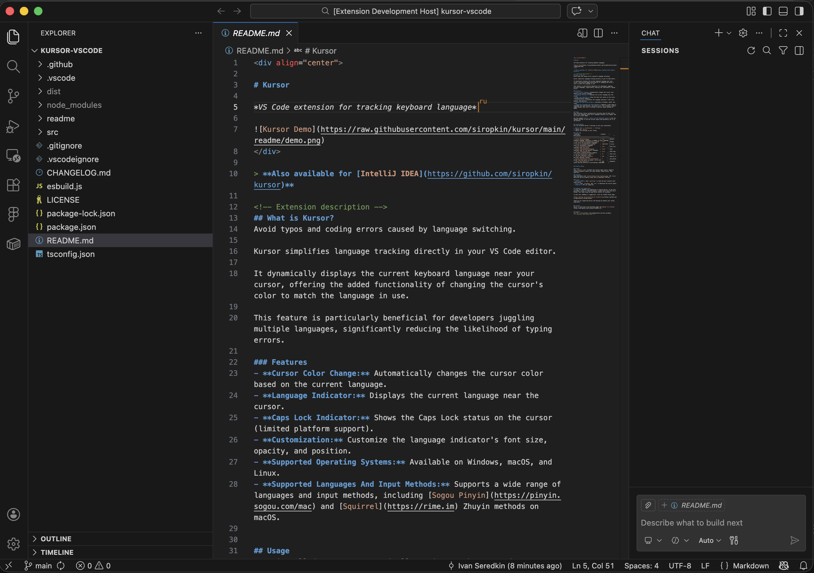

# Kursor

*VS Code extension for tracking keyboard language*

 

> **Also available for IntelliJ IDEA: [GitHub](https://github.com/siropkin/kursor) | [JetBrains Marketplace](https://plugins.jetbrains.com/plugin/22072-kursor)**

<!-- Extension description -->
## What is Kursor?
Avoid typos and coding errors caused by language switching.

Kursor simplifies language tracking directly in your VS Code editor.

It dynamically displays the current keyboard language near your cursor, offering the added functionality of changing the cursor's color to match the language in use.

This feature is particularly beneficial for developers juggling multiple languages, significantly reducing the likelihood of typing errors.

### Features
- **Cursor Color Change:** Automatically changes the cursor color based on the current language.
- **Language Indicator:** Displays the current language near the cursor.
- **Caps Lock Indicator:** Shows the Caps Lock status on the cursor (limited platform support).
- **Customization:** Customize the language indicator's colors and background.
- **Supported Operating Systems:** Available on Windows, macOS, and Linux.
- **Supported Languages And Input Methods:** Supports a wide range of languages and input methods, including Apple's built-in Chinese input methods (Pinyin, Wubi, Zhuyin, Cangjie), [Sogou Pinyin](https://pinyin.sogou.com/mac), and [Squirrel](https://rime.im) on macOS.

## Usage
Once installed, Kursor automatically activates when VS Code starts. Switch your keyboard layout and a language indicator will appear near the cursor within 500ms.

Use the command **Kursor: Detect Current Keyboard Layout** (from the Command Palette) to see the current layout and optionally set it as the default.

## Customization
You can customize Kursor's settings to suit your preferences:

1. Go to `File` > `Preferences` > `Settings`.
2. Search for `Kursor`.
3. Adjust the settings to your liking.

### Settings
| Setting                                 | Default     | Description                                                                  |
| --------------------------------------- | ----------- | ---------------------------------------------------------------------------- |
| `kursor.defaultLanguage`                | `"us"`      | Default keyboard language. Indicator is hidden for this language.             |
| `kursor.indicateCapsLock`               | `true`      | Show Caps Lock status (limited platform support).                            |
| `kursor.indicateDefaultLanguage`        | `false`     | Show indicator even for the default language.                                |
| `kursor.cursor.color`                   | `"#FF8C00"` | Cursor color for non-default languages. Leave empty to disable.              |
| `kursor.showTextIndicator`              | `true`      | Show text indicator near the cursor.                                         |
| `kursor.textIndicator.color`            | `"#FF8C00"` | Text color of the language indicator.                                        |
| `kursor.textIndicator.backgroundColor`  | `""`        | Background color of the text indicator. Leave empty for no background.       |
| `kursor.pollingInterval`                | `500`       | Keyboard layout polling interval in milliseconds (100-5000).                 |

## Platform Notes

### macOS
Uses `defaults read` to detect the current input source. Supports standard keyboard layouts and input methods (Apple's built-in Chinese IME, Sogou Pinyin, Rime Squirrel).

### Windows
Uses PowerShell with `System.Windows.Forms.InputLanguage` API. First detection may be slightly slower due to PowerShell startup.

### Linux
- **GNOME desktops** (Ubuntu, Fedora, Pop!_OS, etc.): Uses `gsettings` to read the most recently used input source. Works on both X11 and Wayland.
- **Other X11 desktops:** Falls back to `setxkbmap` and `xset` to determine the active layout.
- **Non-GNOME Wayland:** Not yet supported.

## Feedback and Suggestions
I value your feedback and suggestions to improve Kursor. If you have any ideas, issues, or feature requests, please share them with me on GitHub. Your input helps me make Kursor better for everyone.

To post your feedback or suggestions, visit our GitHub Issues page:

[https://github.com/siropkin/kursor-vscode/issues](https://github.com/siropkin/kursor-vscode/issues)

Thank you for supporting Kursor and helping me enhance your coding experience.

## License
Kursor is open-source and available under the [Apache 2.0 license](https://www.apache.org/licenses/LICENSE-2.0).

## Support
[Buy Me A Coffee](https://www.buymeacoffee.com/ivan.seredkin)
<!-- Extension description end -->
